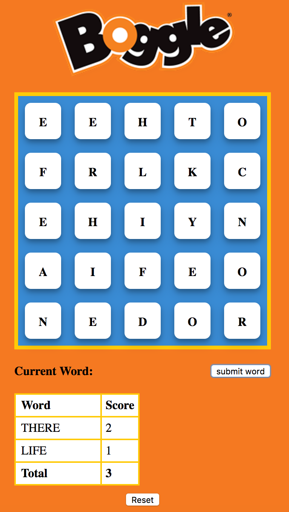

# Boggle

[Live Site](https://spookybit.github.io/boggle/)

Simple boggle clone made entirely out of javascript and HTML elements. Uses query selectors and attaches event handlers to allow the user to interact with the page's elements.

