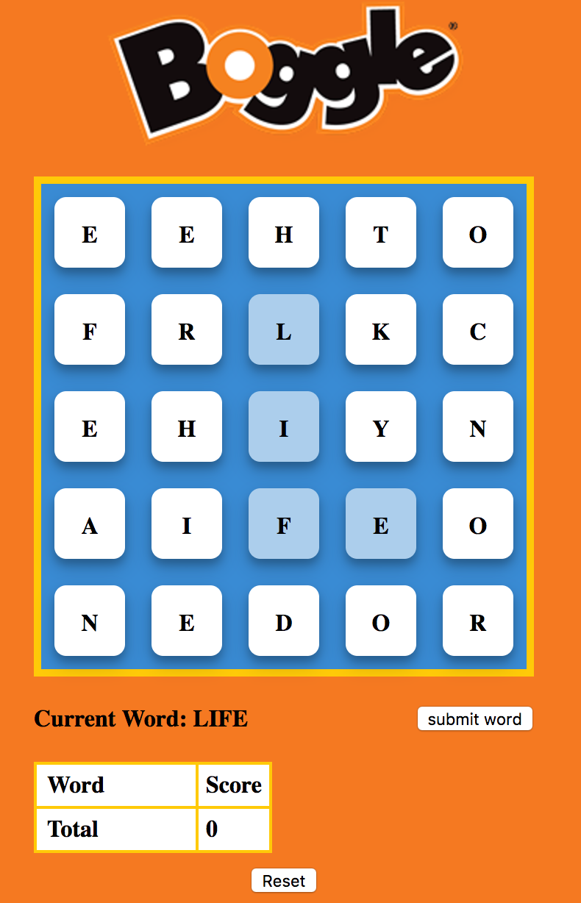

# Boggle

[Live Site](https://spookybit.github.io/boggle/)

Simple boggle clone made entirely out of javascript and HTML elements. Uses query selectors and attaches event handlers to allow the user to interact with the page's elements.

Rules:
180 seconds to enter as many words as you can
Letters forming a word must be chained next to the last letter selected
No repeat words allowed

